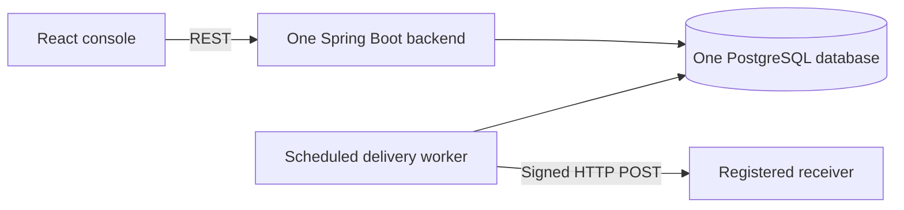

# SignalDock

SignalDock is a small webhook delivery service, similar in spirit to how Stripe or GitHub send webhooks: you register a URL, send events, and SignalDock delivers them with signatures, retries and a full attempt history.

## Why I built it

Webhooks look simple until a receiver is slow, down, or gets the same event twice. I wanted to build the reliable version end to end: an idempotent API, a database-backed queue, signed requests, retries with backoff, and a dashboard that shows exactly what happened to every delivery.

## Features

- **Idempotent event ingestion:** the same `Idempotency-Key` never creates a second event (PostgreSQL `ON CONFLICT DO NOTHING`).
- **Wildcard routing:** subscriptions match exact types (`order.created`), trailing wildcards (`order.*`), or everything (`*`).
- **PostgreSQL queue:** workers claim due deliveries with `FOR UPDATE SKIP LOCKED`, and a lease makes abandoned work claimable again.
- **Retries with exponential backoff** and a terminal `DEAD` state once the attempt budget is used up.
- **HMAC-SHA256 signed requests** with `X-SignalDock-*` headers so receivers can verify and deduplicate.
- **Attempt history and manual retry:** every HTTP attempt is stored; a `DEAD` delivery can be retried with a fresh attempt budget.
- **React dashboard** for sending events, managing endpoints and routes, and inspecting deliveries.
- **Docker Compose demo and GitHub Actions CI** (unit tests, PostgreSQL Testcontainers tests, frontend build, image build).

## Architecture



An event and all of its delivery rows are saved in one transaction. The worker then works in three steps: it **claims** a batch of due deliveries in one short transaction, makes the **HTTP call outside any transaction** (so a slow receiver never holds a database lock), and **records the outcome** in a second short transaction. More detail is in [`docs/ARCHITECTURE.md`](docs/ARCHITECTURE.md) and [`docs/ER_DIAGRAM.md`](docs/ER_DIAGRAM.md).

## Run it

Prerequisite: Docker with Compose.

```bash
docker compose up --build
```

Open [http://localhost:3000](http://localhost:3000) and connect with the demo key:

```text
sd_demo_local_key
```

1. Send the default `order.created` event. The seeded demo receiver answers HTTP 202, so the delivery becomes `DELIVERED` and its signed attempt appears in the timeline.
2. Send an event with type `benchmark.retry`. The second seeded receiver always answers HTTP 503, so the delivery retries with backoff and ends as `DEAD` after 3 attempts. Click **Retry delivery** to give it a fresh budget.

Swagger UI is at [http://localhost:8080/docs](http://localhost:8080/docs) and health at [http://localhost:8080/actuator/health](http://localhost:8080/actuator/health).

If you ran an older version, reset once with `docker compose down -v`.

To run the parts separately, start only the database with `docker compose up -d postgres`, then run `mvn spring-boot:run -Dspring-boot.run.profiles=demo` in `backend/` and `npm ci && npm run dev` in `frontend/` (Vite proxies `/api` to port 8080).

## API example

Every `/api/v1` call needs the `X-API-Key` header. Sending an event also needs an `Idempotency-Key`:

```bash
curl -i -X POST http://localhost:8080/api/v1/events \
  -H "Content-Type: application/json" \
  -H "X-API-Key: sd_demo_local_key" \
  -H "Idempotency-Key: checkout-42" \
  -d '{"eventType":"order.created","payload":{"orderId":"42","amount":1299}}'
```

The first request returns `201 Created`. Sending the same request with the same key again returns `200 OK` with the same `eventId` and `"duplicate": true`, and no new deliveries are created.

Register an endpoint (the signing secret is returned only in this response), then route events to it:

```bash
curl -X POST http://localhost:8080/api/v1/endpoints \
  -H "Content-Type: application/json" \
  -H "X-API-Key: sd_demo_local_key" \
  -d '{"name":"Orders API","url":"https://example.com/callback","maxAttempts":5}'

curl -X POST http://localhost:8080/api/v1/endpoints/ENDPOINT_ID/subscriptions \
  -H "Content-Type: application/json" \
  -H "X-API-Key: sd_demo_local_key" \
  -d '{"eventPattern":"order.*"}'
```

## Tests

```bash
# Backend unit + PostgreSQL integration tests (needs Docker for Testcontainers)
cd backend
mvn test

# Frontend type-check and production build
cd ../frontend
npm ci
npm run build
```

CI runs both and builds the Compose images on every pull request and every push to `main`.

## Design decisions

- **PostgreSQL queue instead of Kafka:** the event and its delivery jobs commit together, so there is no "saved the event but lost the message" gap, and there is one less system to run.
- **HTTP outside transactions:** a receiver that takes 4 seconds to time out never holds a row lock or a pooled connection for those 4 seconds.
- **At-least-once delivery:** if the app crashes after the receiver accepted a request but before the outcome is saved, the lease expires and the delivery is sent again. Receivers should deduplicate on `X-SignalDock-Delivery-Id`.
- **Polling instead of WebSockets:** the dashboard refreshes every 4 seconds, which is plenty for an operations view and much simpler.

## Known limitations

- A single API key for all clients; there are no users, tenants or key rotation.
- Endpoint signing secrets are stored in plain text, because the worker needs them to sign every attempt.
- No SSRF protection: endpoint URLs get basic validation only. A production version would block private and internal IP addresses.
- Designed for a single application instance and a single database.
- Delivery is at least once, not exactly once.

## License

MIT. Built by Yashwardhan Verma ([GitHub](https://github.com/YashwardhanV) · [LinkedIn](https://www.linkedin.com/in/yashwardhanv)).
