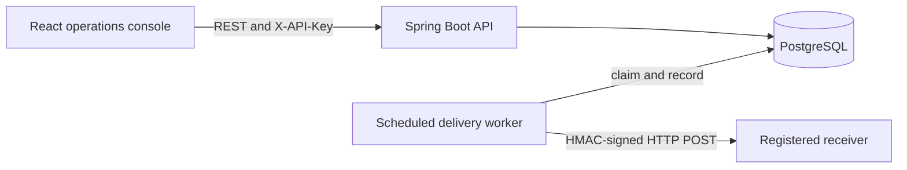

# SignalDock

## Project Architecture

**Project owner and maintainer:** [Yashwardhan Verma](https://www.linkedin.com/in/yashwardhanv)  
**GitHub:** [YashwardhanV](https://github.com/YashwardhanV)  
**Public email:** [yashwardhanverma108@gmail.com](mailto:yashwardhanverma108@gmail.com)

SignalDock is an event callback delivery platform built as a modular monolith. Clients register endpoints and event routes, submit idempotent JSON events, and inspect signed delivery attempts, retry schedules, and exhausted work from a React operations console.



- **Frontend:** React, TypeScript, Vite, and Tailwind CSS provide endpoint management, event submission, delivery summaries, attempt timelines, and manual retry controls.
- **Backend:** Java 21 and Spring Boot separate API-key security, endpoint configuration, route matching, event ingestion, delivery processing, and error handling into domain packages inside one deployable application.
- **Atomic ingestion:** PostgreSQL `INSERT ... ON CONFLICT DO NOTHING` makes the idempotency key authoritative. A new event and all delivery jobs matched by exact, global, or trailing-wildcard routes are committed in one transaction.
- **Delivery queue:** A scheduled worker claims due rows with `FOR UPDATE SKIP LOCKED`, changes them to `PROCESSING`, records a lease, and commits. The outbound HTTP call runs outside a database transaction. A short outcome transaction then records the attempt and moves the delivery to `DELIVERED`, `RETRY_PENDING`, or `DEAD`.
- **Failure recovery:** Exponential backoff bounds automatic retries. Expired leases make abandoned work claimable after a process failure. Delivery is intentionally at least once; a stable delivery ID lets receivers deduplicate the crash window between remote success and the local outcome commit.
- **Request integrity:** Each outbound body is signed with HMAC-SHA256 over `timestamp.rawPayload`. Identity headers, timeouts, disabled redirects, response truncation, and public-address URL checks reduce delivery risk.
- **Security and persistence:** Raw API keys are shown once and only their SHA-256 hashes are stored. Flyway manages the PostgreSQL schema, while normalized tables retain endpoints, subscriptions, events, deliveries, and every attempt.

## How to Run

1. Install Docker Desktop or Docker Engine with Docker Compose.
2. From the repository root, optionally copy `.env.example` to `.env` to customize local ports, keys, timeouts, and retry settings.
3. Build and start PostgreSQL, the backend worker, and the frontend:

   ```bash
   docker compose up --build
   ```

4. Open the application and supporting endpoints:

   - Operations console: <http://localhost:3000>
   - Backend health: <http://localhost:8080/actuator/health>
   - OpenAPI UI: <http://localhost:8080/docs>
   - OpenAPI JSON: <http://localhost:8080/api-docs>

5. Use the prefilled demo API key `sd_demo_local_key`. Send the default `order.created` event to observe a successful delivery. Send `benchmark.retry` to observe retries, transition to `DEAD`, and the manual retry action.
6. Stop the stack without deleting PostgreSQL data:

   ```bash
   docker compose down
   ```

For local development, start PostgreSQL with `docker compose up -d postgres`. Run `mvn spring-boot:run -Dspring-boot.run.profiles=demo` from `backend`, then run `npm ci` and `npm run dev` from `frontend` in a second terminal.

Run the verification suites with:

```bash
cd backend
mvn test

cd ../frontend
npm ci
npm run build
```

Backend integration tests require Docker because they exercise the real PostgreSQL schema and concurrency behavior through Testcontainers.

## Interview Prep

**Q: Why use PostgreSQL as the queue instead of introducing a message broker?**

**A:** Event acceptance and initial delivery creation must be atomic. Keeping both in PostgreSQL removes a dual-write failure window, and row locks, due-time indexes, leases, and constraints satisfy the current workload. A broker becomes useful when measured burst volume, independent consumer scaling, or event-stream replay justifies an outbox and additional operations.

**Q: How does idempotent event ingestion work under concurrent retries?**

**A:** The database has a unique idempotency-key invariant, and ingestion uses `INSERT ... ON CONFLICT DO NOTHING`. The winning request creates the event and matched deliveries in one transaction; losing requests load and return the existing event. This is safe across threads and instances, unlike check-then-insert logic in Java.

**Q: What do `SKIP LOCKED` and leases solve?**

**A:** `SKIP LOCKED` lets concurrent workers claim different due rows without waiting on the same batch. The selected rows become `PROCESSING` with a lease inside the claim transaction. If a worker crashes, the expired lease makes the row eligible again instead of leaving it permanently stuck.

**Q: Why is the outbound HTTP call outside the database transaction?**

**A:** A receiver may take until the configured timeout to respond. Holding a connection and row lock during that network wait would reduce throughput and increase contention. SignalDock uses short claim and outcome transactions, with the lease covering the non-transactional network interval.

**Q: Can SignalDock guarantee exactly-once delivery?**

**A:** No. If the receiver accepts a request and the process fails before recording the outcome, lease recovery sends it again. The system therefore provides at-least-once delivery and includes a stable delivery ID so the receiver can implement idempotency.

**Q: Why sign `timestamp.rawPayload` with HMAC-SHA256?**

**A:** Signing the exact raw body proves integrity and authenticity to a receiver that holds the shared secret. Including the timestamp lets the receiver reject stale replays. The receiver must compare signatures in constant time and define its own acceptable clock window.

**Q: Why store API-key hashes but not hash endpoint signing secrets?**

**A:** API authentication only needs one-way comparison, so a high-entropy key can be hashed before storage. Outbound HMAC generation needs the original signing secret, so production handling requires encryption or a secret-manager reference rather than a non-recoverable hash.
