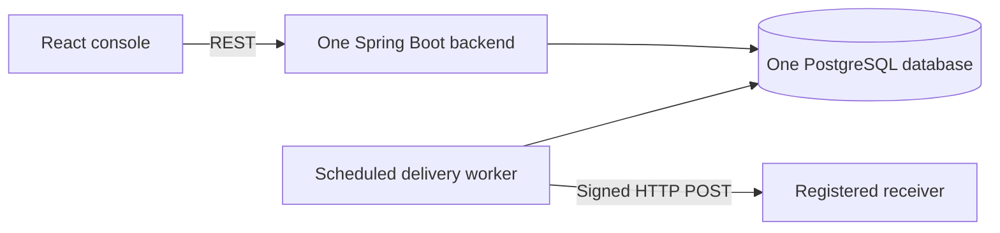

# SignalDock

SignalDock is a small event callback delivery platform built to demonstrate strong SDE-1 backend fundamentals without hiding the important work behind a distributed platform. Clients register receiver endpoints and event routes, submit idempotent JSON events, and inspect signed HTTP delivery attempts, retries, and exhausted work from a React operations console.

**Project owner and maintainer:** [Yashwardhan Verma](https://www.linkedin.com/in/yashwardhanv)  
**GitHub:** [YashwardhanV](https://github.com/YashwardhanV)  
**Public email:** [yashwardhanverma108@gmail.com](mailto:yashwardhanverma108@gmail.com)


## Main features

- Endpoint registration with active/inactive state, one-time signing-secret display, URL validation, and configurable maximum attempts.
- Exact, global (`*`), and trailing-wildcard routes such as `order.*`.
- Atomic, idempotent event ingestion using PostgreSQL `ON CONFLICT` and database uniqueness.
- PostgreSQL-backed delivery queue with `FOR UPDATE SKIP LOCKED`, bounded claims, leases, and abandoned-work recovery.
- HMAC-SHA256 signatures over `timestamp.rawPayload` with event/delivery identity headers.
- Configurable connection/read timeouts, exponential backoff, terminal `DEAD` state, full attempt history, response truncation, and manual retry.
- Paginated DTO-based REST APIs, bean validation, central error responses, request IDs, health endpoint, and OpenAPI UI.
- Hash-only API-key authentication and admin-controlled one-time key creation.
- Responsive React/TypeScript/Tailwind console with live summary, event composer, endpoint routes, attempt timeline, and retry action.
- Flyway migrations, JUnit 5 unit tests, PostgreSQL Testcontainers integration tests, Docker Compose, seed data, benchmark utility, and GitHub Actions CI.

## Architecture



The event and its delivery jobs are committed together. The worker claims rows in a short transaction, performs network I/O outside any database transaction, then records the outcome in another short transaction. Read the detailed [`architecture`](docs/ARCHITECTURE.md) and [`ER diagram`](docs/ER_DIAGRAM.md).

## Run the five-minute demo

Prerequisite: Docker Desktop with Compose.

```bash
docker compose up --build
```

Open [http://localhost:3000](http://localhost:3000). The demo key is already entered:

```text
sd_demo_local_key
```

Click **Send event** with the default `order.created` payload. The seeded demo receiver returns HTTP 202, so the new delivery becomes `DELIVERED` and its signed attempt appears in the timeline. To see backoff and terminal failure, send event type `benchmark.retry`; the second seeded receiver returns HTTP 503 until the delivery becomes `DEAD`, after which **Retry delivery** is enabled.

Other useful URLs:

- API health: [http://localhost:8080/actuator/health](http://localhost:8080/actuator/health)
- Swagger UI: [http://localhost:8080/docs](http://localhost:8080/docs)
- OpenAPI JSON: [http://localhost:8080/api-docs](http://localhost:8080/api-docs)

Stop with `docker compose down`. Add `-v` only when you intentionally want to delete the local demo database.

## API examples

All normal APIs require `X-API-Key`. Event ingestion also requires `Idempotency-Key`.

```bash
curl -i -X POST http://localhost:8080/api/v1/events \
  -H "Content-Type: application/json" \
  -H "X-API-Key: sd_demo_local_key" \
  -H "Idempotency-Key: checkout-42" \
  -d '{"eventType":"order.created","payload":{"orderId":"42","amount":1299}}'
```

The first request returns `201 Created`; repeating the same request/key returns `200 OK`, the same `eventId`, and `duplicate: true`.

Create a non-demo API key (the raw key is returned once):

```bash
curl -X POST http://localhost:8080/api/v1/admin/api-keys \
  -H "Content-Type: application/json" \
  -H "X-Admin-Key: local-admin-key" \
  -d '{"name":"portfolio-client"}'
```

Create a receiver and route:

```bash
curl -X POST http://localhost:8080/api/v1/endpoints \
  -H "Content-Type: application/json" \
  -H "X-API-Key: sd_demo_local_key" \
  -d '{"name":"Orders API","url":"https://example.com/callback","maxAttempts":5}'

curl -X POST http://localhost:8080/api/v1/endpoints/ENDPOINT_ID/subscriptions \
  -H "Content-Type: application/json" \
  -H "X-API-Key: sd_demo_local_key" \
  -d '{"eventPattern":"order.*"}'
```

List APIs accept `page` and `size`; deliveries additionally accept `status` and ISO-8601 `createdAfter`. See Swagger and the checked-in [`REST API guide`](docs/API.md) for the complete contract and status codes.

## Local development without full Compose

Start only PostgreSQL:

```bash
docker compose up -d postgres
```

Backend (Java 21 and Maven required):

```bash
cd backend
mvn spring-boot:run -Dspring-boot.run.profiles=demo
```

Frontend (Node.js 22 recommended):

```bash
cd frontend
npm ci
npm run dev
```

The Vite development server proxies `/api` and `/actuator` to port 8080.

## Tests

Backend unit and real-PostgreSQL integration tests (Docker must be available for Testcontainers):

```bash
cd backend
mvn test
```

The test set targets retry math, pattern matching, delivery state changes, HMAC output, HTTP signing/timeout behavior, URL safety, authentication, idempotency, database uniqueness, and manual retry. It favors meaningful behavior over an arbitrary coverage target.

Frontend type-check and production build:

```bash
cd frontend
npm ci
npm run build
```

CI repeats both checks and builds the Compose images in [`.github/workflows/ci.yml`](.github/workflows/ci.yml).

The final local test, build, dependency-audit, health, and Compose outcomes are recorded in [`docs/VERIFICATION.md`](docs/VERIFICATION.md).

## Benchmarks

Start the Compose demo, then run:

```bash
node scripts/benchmark.mjs
```

Override the repeatable workload without editing code:

```bash
EVENTS=100 RUNS=3 CONCURRENCY=10 DUPLICATES=25 node scripts/benchmark.mjs
```

PowerShell equivalent:

```powershell
$env:EVENTS=100; $env:RUNS=3; $env:CONCURRENCY=10; node scripts/benchmark.mjs
```

The script checks duplicate idempotency responses, submits successful deliveries, polls them to terminal state, fetches attempt timings, and verifies the three-attempt failure path. It prints machine-readable JSON and exits nonzero on correctness failures. Only observed results are recorded in [`docs/BENCHMARK_RESULTS.md`](docs/BENCHMARK_RESULTS.md); no values are extrapolated.

## Important engineering decisions

- **PostgreSQL queue instead of Kafka:** the accepted event and all initial work share one ACID transaction. This removes broker dual-write handling and keeps the project locally understandable.
- **Leases plus `SKIP LOCKED`:** safe concurrent claims and crash recovery without a second queue product.
- **Network outside transactions:** a slow receiver cannot hold database locks/connections for its entire timeout.
- **At-least-once delivery:** a crash after the receiver accepts but before outcome commit can cause a duplicate. Stable delivery IDs make receiver-side deduplication possible; pretending exactly-once HTTP exists would be misleading.
- **Database invariants:** unique and check constraints are the final correctness layer under concurrent requests.
- **Polling UI:** four-second refresh is enough for an operations dashboard and is easier to operate than a WebSocket lifecycle.

## Configuration

Copy `.env.example` to `.env` to change Compose defaults. Database credentials, ports, admin/demo keys, worker batch/poll/lease settings, timeouts, retry delays, response limit, CORS origins, and URL-safety flags are environment-driven. Defaults are for local demonstration only. Outside the demo profile, HTTP/private receiver addresses are denied.

## Known limitations

- One database and one application are intentional; no multi-region or independent service scaling.
- Delivery is at least once. Receivers should deduplicate using the delivery ID.
- URL validation reduces SSRF risk but does not eliminate DNS rebinding between validation and connection.
- Signing secrets are stored as application-readable plaintext because background signing needs them; a real deployment should use envelope encryption or a managed secret reference.
- API keys are global rather than tenant-scoped; there is no user/organization model, rotation UI, or audit actor identity.
- The dashboard polls and shows the latest 100 records rather than offering full server-side filter controls.
- The in-process scheduler has no admission/rate policy per destination.

## Future improvements, in evidence-driven order

1. Secret rotation and encrypted-at-rest signing credentials.
2. Receiver-aware concurrency/rate limits and a circuit-breaker policy, backed by load/failure measurements.
3. Tenant ownership and per-key authorization if multi-user requirements appear.
4. A transactional outbox and broker only if measured ingestion bursts or independent consumers exceed the PostgreSQL queue's needs.
5. WebSocket/SSE dashboard updates only if polling traffic becomes material.

## Interview preparation and resume claims

- [`docs/INTERVIEW_GUIDE.md`](docs/INTERVIEW_GUIDE.md) explains each major feature, failure cases, tradeoffs, class/table map, and likely questions.
- [`docs/RESUME_BULLETS.md`](docs/RESUME_BULLETS.md) contains exactly three implementation-only bullets and three benchmark-backed bullets.
- [`SDE1_AUDIT.md`](SDE1_AUDIT.md) scores depth and highlights what to understand before using the project on a resume.

## License

SignalDock's code and documentation are copyright Yashwardhan Verma and available under the MIT License.
