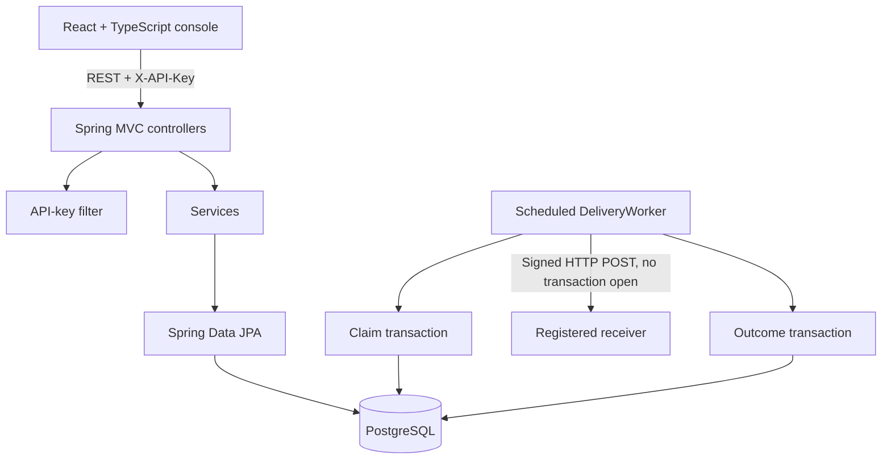
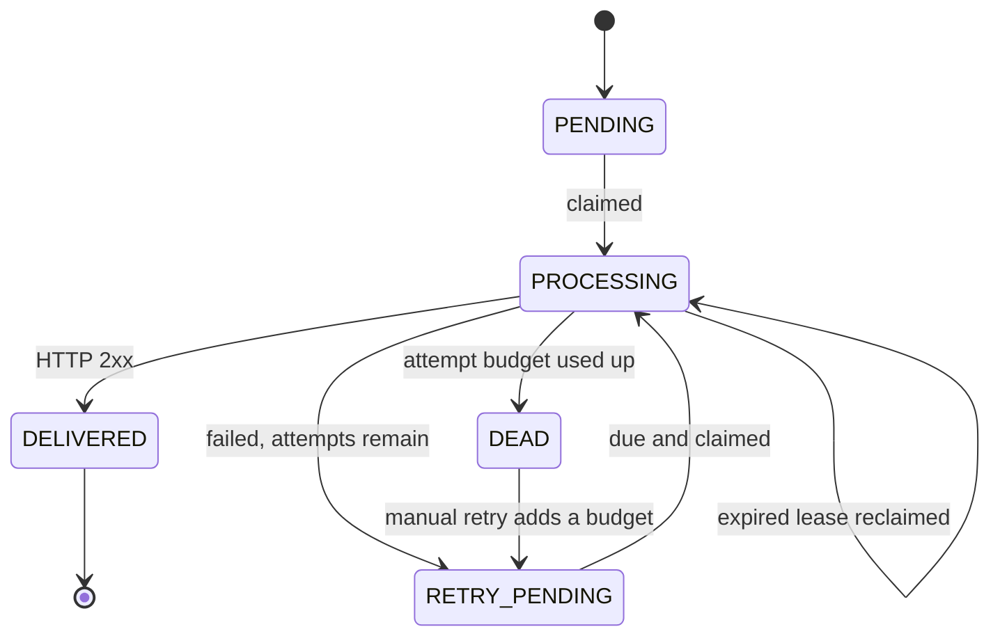

# SignalDock Architecture

## System shape

SignalDock is a modular monolith: one React client, one Spring Boot process and one PostgreSQL database. Packages separate the concerns, but there are no network calls between backend modules.

The frontend polls a snapshot every four seconds.

## Backend packages

| Package | Responsibility | Important classes |
|---|---|---|
| `security` | Compare `X-API-Key` with the one configured key | `ApiKeyAuthenticationFilter`, `SecurityConfig` |
| `endpoint` | Register and pause receivers, validate URLs, generate signing secrets | `EndpointController`, `EndpointService`, `EndpointUrlValidator` |
| `subscription` | Event-pattern routes and exact / `order.*` / `*` matching | `SubscriptionService`, `EventPatternMatcher` |
| `event` | Idempotent ingestion and creating one delivery per matched endpoint | `EventController`, `EventService`, `EventRepository` |
| `delivery` | Queue claim, HTTP sending, signing, attempts, backoff, manual retry | `DeliveryWorker`, `DeliveryWorkerService`, `DeliveryService`, `DeliveryHttpClient`, `RetryPolicy` |
| `exception` | One JSON error shape for every failure | `GlobalExceptionHandler`, `ApiError` |
| `config` | Typed settings, OpenAPI, pagination | `AppProperties`, `OpenApiConfig`, `PageResponse` |
| `demo` | Demo seed data and success (202) / failure (503) receivers | `DemoDataInitializer`, `DemoReceiverController` |

## Event ingestion

`EventService.ingest` runs in one transaction:

1. `INSERT ... ON CONFLICT (idempotency_key) DO NOTHING`. If no row was inserted, the key was seen before: return the existing event with `duplicate: true` (HTTP 200).
2. Otherwise load active subscriptions on active endpoints, keep the ones whose pattern matches, and save one `PENDING` delivery per distinct endpoint.
3. Commit. The event and its deliveries become visible together, or not at all (HTTP 201).

## Delivery worker

`DeliveryWorker.poll` runs every `app.delivery.poll-delay` milliseconds:

1. `DeliveryWorkerService.claimDue` (transaction 1) selects due `PENDING`/`RETRY_PENDING` rows, plus `PROCESSING` rows whose `lease_until` has passed, using `FOR UPDATE SKIP LOCKED` with a batch limit. Each row becomes `PROCESSING` with a new lease.
2. `DeliveryWorkerService.prepare` reads the URL, secret and raw payload.
3. `DeliveryHttpClient.deliver` signs and sends the request **with no transaction open**. Connect/read timeouts bound the wait; redirects are not followed.
4. `DeliveryWorkerService.recordOutcome` (transaction 2) locks the row with `findByIdForUpdate`, returns early unless it is still `PROCESSING`, saves a `delivery_attempts` row and moves the delivery to `DELIVERED`, `RETRY_PENDING` or `DEAD`.

`DeliveryWorker` calls these methods on a separate bean, so Spring's `@Transactional` proxy applies to each call. If the process dies between steps 1 and 4, the lease expires and another poll reclaims the row. That is why delivery is at least once.

## Delivery state machine

Backoff after attempt `n` is `min(baseDelay × 2^(n-1), maxDelay)`. A manual retry keeps every old attempt and adds the endpoint's `maxAttempts` to the delivery's budget.

## Signature contract

Each attempt sends `X-SignalDock-Timestamp` (Unix seconds), `X-SignalDock-Signature` (`sha256=` + hex HMAC-SHA256 of `timestamp + "." + rawPayload`), and `X-SignalDock-Event-Id`, `X-SignalDock-Event-Type`, `X-SignalDock-Delivery-Id`. Receivers should recompute the HMAC over the exact raw body, compare in constant time, and reject old timestamps.

## Security boundaries

- All `/api/v1/**` routes need `X-API-Key`; it is compared in constant time with `app.api-key`.
- Health, Swagger/OpenAPI and the demo receivers are public. Demo beans exist only with the `demo` profile.
- A new endpoint's signing secret is returned once; later reads show only a hint.
- Endpoint URLs must be `http`/`https`, have a host and contain no credentials. There is no SSRF protection (see README limitations).
