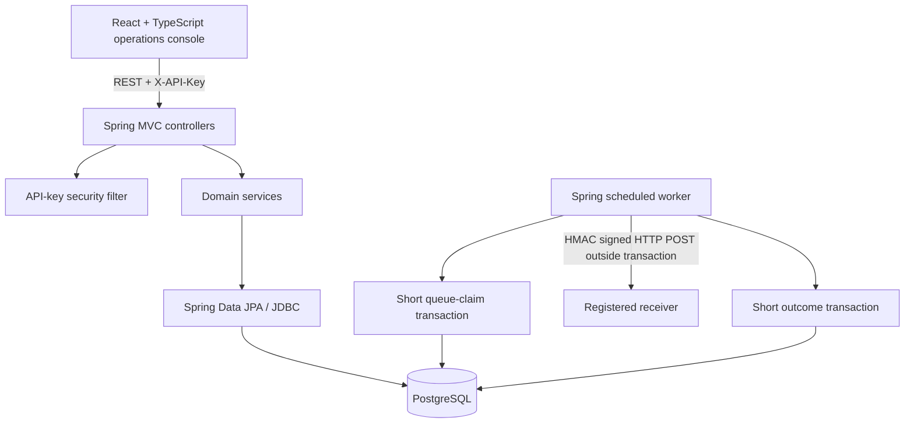
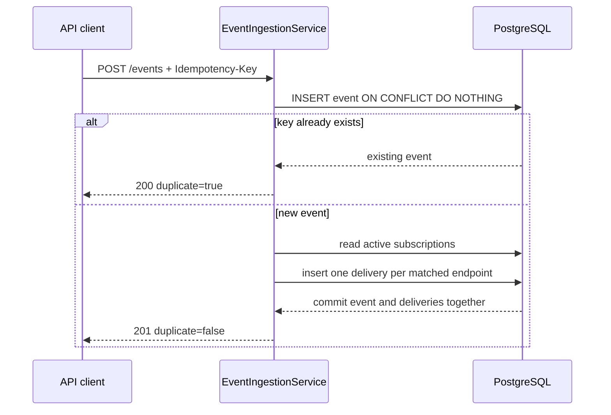
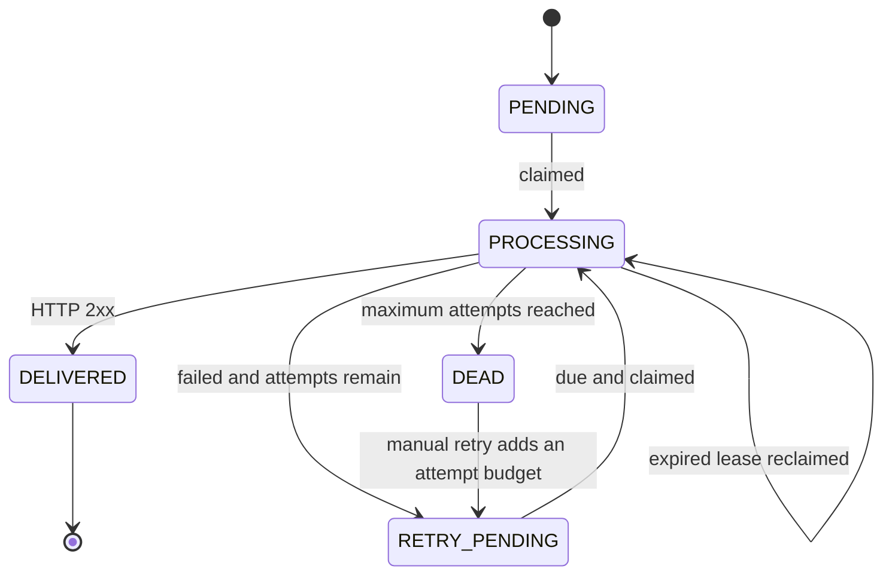

# SignalDock Architecture

## System shape

SignalDock is a modular monolith: one React client, one Spring Boot process, and one PostgreSQL database. Package boundaries separate security, endpoint configuration, subscriptions, event ingestion, delivery, and demo concerns, but there are no network calls between backend modules.

The frontend polls a compact snapshot every four seconds. WebSockets are deliberately absent because dashboard updates are informational, not interactive enough to justify another connection lifecycle.

## Backend modules

| Package | Responsibility | Important classes |
|---|---|---|
| `security` | Hash-only API-key authentication and one-time key issuance | `ApiKeyAuthenticationFilter`, `ApiKeyAdminController`, `ApiKeyHasher` |
| `endpoint` | Destination registration, URL safety, activation, signing-secret lifecycle | `EndpointController`, `EndpointService`, `EndpointUrlValidator` |
| `subscription` | Event-pattern routes and exact/trailing-wildcard matching | `SubscriptionService`, `EventPatternMatcher` |
| `event` | Validation, idempotent persistence, route matching, atomic job creation | `EventIngestionService`, `EventRepository` |
| `delivery` | Queue state, leases, HTTP transport, signing, attempts, backoff, replay | `DeliveryWorker`, `DeliveryQueueService`, `DeliveryProcessingService`, `DeliveryHttpClient`, `RetryPolicy` |
| `exception` | Stable error response and field-validation errors | `GlobalExceptionHandler`, `ApiError` |
| `config` | Environment settings, OpenAPI, request IDs, pagination | `AppProperties`, `RequestIdFilter`, `PageResponse` |
| `demo` | Compose-only seed routes and deterministic success/failure receiver | `DemoDataInitializer`, `DemoReceiverController` |

## Event ingestion transaction

The event and all initial delivery jobs share one database transaction. This removes the database/Kafka dual-write gap: either both accepted data and work exist, or neither does. Unique indexes remain the final authority under concurrent duplicate requests.

## Delivery worker transaction boundaries

1. `DeliveryQueueService.claimDue` opens a short transaction, selects due `PENDING`/`RETRY_PENDING` rows or expired leases with `FOR UPDATE SKIP LOCKED`, changes them to `PROCESSING`, sets a lease, and commits.
2. `DeliveryProcessingService.prepare` reads an immutable work item.
3. `DeliveryHttpClient` signs and sends the request **without an open database transaction**. Connection/read timeouts bound the wait; redirects are disabled.
4. `DeliveryProcessingService.recordOutcome` opens a new transaction, locks the row, inserts an attempt, and changes it to `DELIVERED`, `RETRY_PENDING`, or `DEAD`.

If the process stops after claiming but before recording an outcome, `lease_until` expires and the row becomes claimable again. An outbound receiver can therefore observe an at-least-once duplicate in that crash window; the `X-SignalDock-Delivery-Id` header lets receivers deduplicate.

## Delivery state machine

The backoff after attempt `n` is `min(baseDelay × 2^(n-1), maxDelay)`. The calculation caps the exponent and handles arithmetic overflow. A manual retry preserves old attempts and adds the endpoint's configured attempt allowance; it does not pretend the historical failures never happened.

## HTTP signature contract

For each attempt, SignalDock sends:

- `X-SignalDock-Timestamp`: Unix timestamp in seconds.
- `X-SignalDock-Signature`: lowercase HMAC-SHA256 hex of `timestamp + "." + rawPayload`.
- `X-SignalDock-Event-Id`, `X-SignalDock-Event-Type`, and `X-SignalDock-Delivery-Id`.

The receiver should reject stale timestamps, recompute the HMAC using the shared secret and exact raw body bytes, and compare signatures in constant time.

## Security boundaries

- Normal `/api/v1/**` APIs require `X-API-Key`; only SHA-256 hashes are stored.
- The raw key from the admin endpoint and endpoint signing secret are returned once. Later reads expose only hints.
- Admin key creation uses `X-Admin-Key` and constant-time comparison. Its default is explicitly for local development.
- HTTPS and public destination addresses are required by default. The URL validator resolves and checks every returned address to reduce server-side request forgery risk. HTTP/private addresses are enabled only by the Compose demo profile.
- Health, OpenAPI, and the demo receiver are public; demo receiver beans do not exist unless the demo profile enables them.

This is appropriate portfolio hardening, not a claim of complete production security. DNS rebinding after validation, secret rotation, tenant isolation, abuse limiting, and a managed secret store remain known limitations.

## Why PostgreSQL is enough here

The queue is part of the same consistency boundary as accepted events and delivery history. A partial index makes due-work lookup efficient, row locks prevent concurrent claims, leases recover abandoned work, and uniqueness constraints enforce invariants. Kafka would become justified when independently scaling ingestion and delivery, absorbing much larger bursts, or retaining/replaying a shared event stream are measured requirements—not simply to add a keyword.
