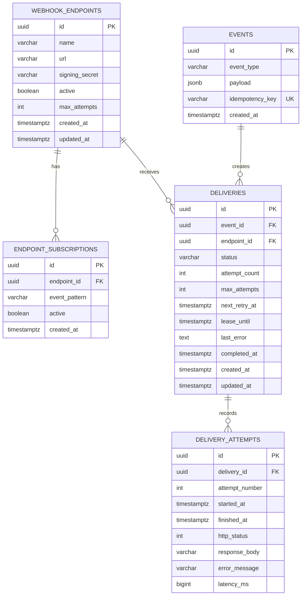

# Database and ER Diagram

## Constraints

- `events.idempotency_key` is unique, so concurrent retries of one request produce one event.
- `(event_id, endpoint_id)` is unique on `deliveries`: two matching patterns cannot create duplicate work for one receiver.
- `(endpoint_id, event_pattern)` is unique on `endpoint_subscriptions`. Patterns are stored in lower case.
- `(delivery_id, attempt_number)` is unique on `delivery_attempts`, which keeps the attempt sequence auditable.
- Check constraints limit `deliveries.status` to the five states, `max_attempts` to 1–12 on endpoints, and keep counters and latency non-negative.
- Endpoints are paused (`active = false`) rather than deleted, so old deliveries keep a valid reference.

## Indexes

| Index | Used by |
|---|---|
| `idx_deliveries_status_next_retry (status, next_retry_at)` | The worker's claim query |
| `idx_deliveries_created_at (created_at DESC)` | The newest-first delivery list |
| `idx_events_created_at (created_at DESC)` | The newest-first event list |
| `uq_delivery_attempt_number (delivery_id, attempt_number)` | Loading a delivery's attempts in order |

`signing_secret` is stored in plain text because the worker needs the original secret to sign each attempt; hashing would make signing impossible.
