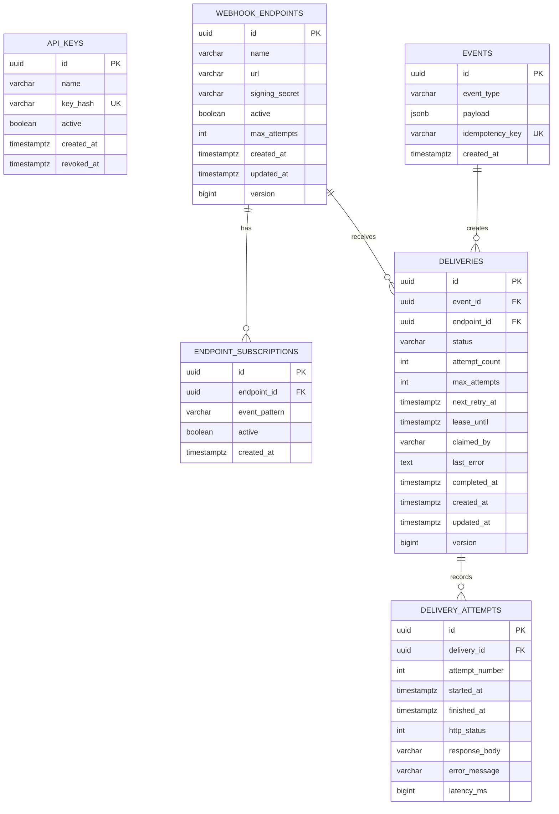

# Database and ER Diagram

## Invariants and constraints

- `events.idempotency_key` is globally unique. Concurrent retries of the same ingestion request return one event.
- `(deliveries.event_id, deliveries.endpoint_id)` is unique. Multiple matching patterns cannot create duplicate work for one receiver.
- `(delivery_attempts.delivery_id, attempt_number)` is unique. Attempt sequence is auditable.
- `(endpoint_id, lower(event_pattern))` is unique for subscriptions.
- Active endpoint URLs are case-insensitively unique through a partial index; a deactivated historical endpoint does not block future reuse.
- Check constraints restrict delivery status, maximum attempts, nonnegative latency/counters, and subscription format.
- Foreign keys keep the event/delivery/attempt graph valid. Endpoint deletion is modeled as deactivation so historical delivery references remain meaningful.

## Query-driven indexes

| Index | Query it supports |
|---|---|
| `idx_delivery_queue` partial `(next_retry_at, created_at)` | Due `PENDING`/`RETRY_PENDING` queue scan. |
| `idx_delivery_expired_leases` partial `(lease_until)` | Recovery of abandoned `PROCESSING` rows. |
| `idx_deliveries_status_created_at` | Filtered, newest-first delivery dashboard. |
| `idx_events_created_at` / `idx_events_type_created_at` | Paginated event history and future type filtering. |
| `idx_attempts_delivery_started_at` | Delivery detail attempt timeline. |
| `idx_active_subscriptions` | Active routing-table load. |

The `signing_secret` column is included because the application must sign later background attempts. A production evolution should encrypt it with a managed key or store a secret reference; hashing is impossible because signing needs the original secret.
